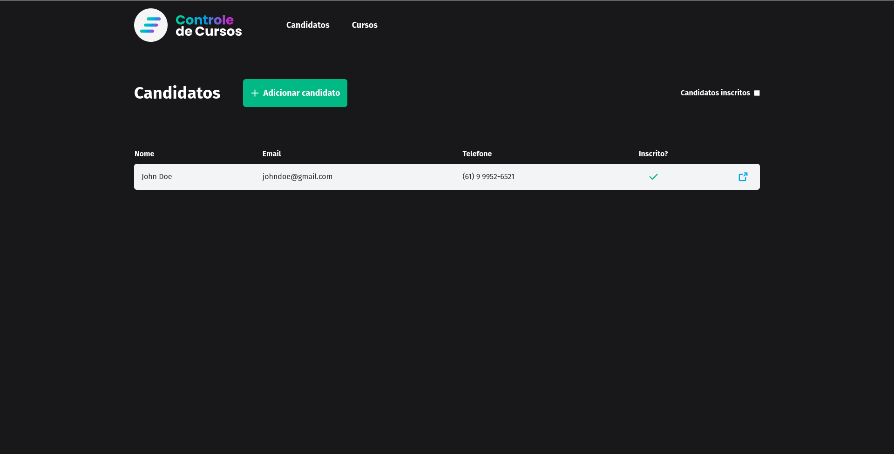

<div align="center"></div>

<br/>

<div align="center">
    <strong> Projeto criado para um desafio tecnico<strong>
</div>
<div align="center">
    <strong>Não finalizado<strong>
</div>

---

## Inicialização do projeto

- Para fazer a inicialização se certifique de que possua a versão `6.0.110` do `dotnet core`

    - Clone o repositório e dentro da pasta do projeto utilize o comando
        ```
        $ dotnet restore
        ```
    - Adicione as variáveis de ambiente no arquivo `.env` (Utilize o arquivo `.env.example` como exemplo)
        ```
        MSSQL_PASSWORD=Password12!
        ```
        ```
        DOTNET_CONNECTION_STRING="Server=localhost,1433;Database=ControleDeCursos;User ID=sa;Password=Password12!"
        ```
        ```
        MSSQL_PORT=6818
        ```

    - Digite o comando do docker compose
        ```
        docker compose up    
        ```
    - Para executar o projeto digite o comando
        ```
        dotnet run
        ```

## Prints do projeto

